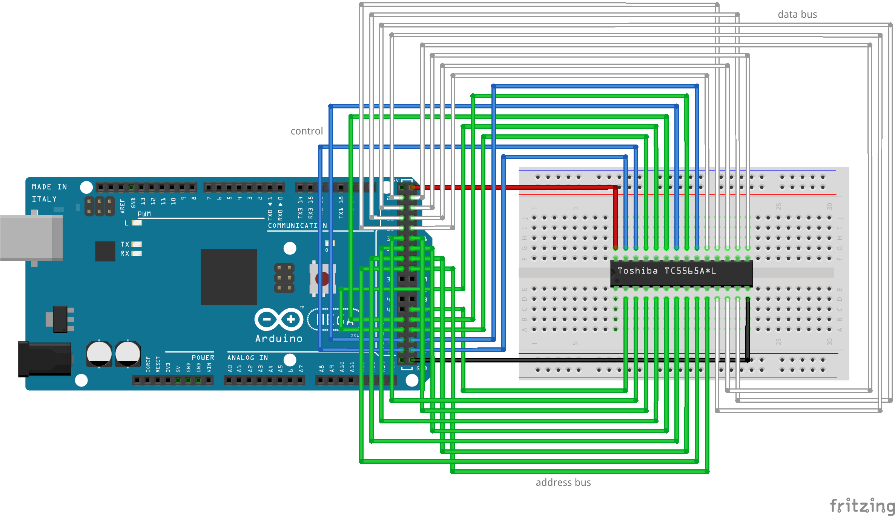

Toshiba TC5565A*L 8192 bytes CMOS RAM chip and Arduino MEGA 2560
================================================================

This Arduino MEGA program shows how to read and write from and to a Toshiba
TC5565A*L 8192 bytes CMOS RAM chip.

It uses the PORT* notation in order to make the program more concise and
faster (having more than 20 digitalWrite calls for writing one byte is not
very efficient).

