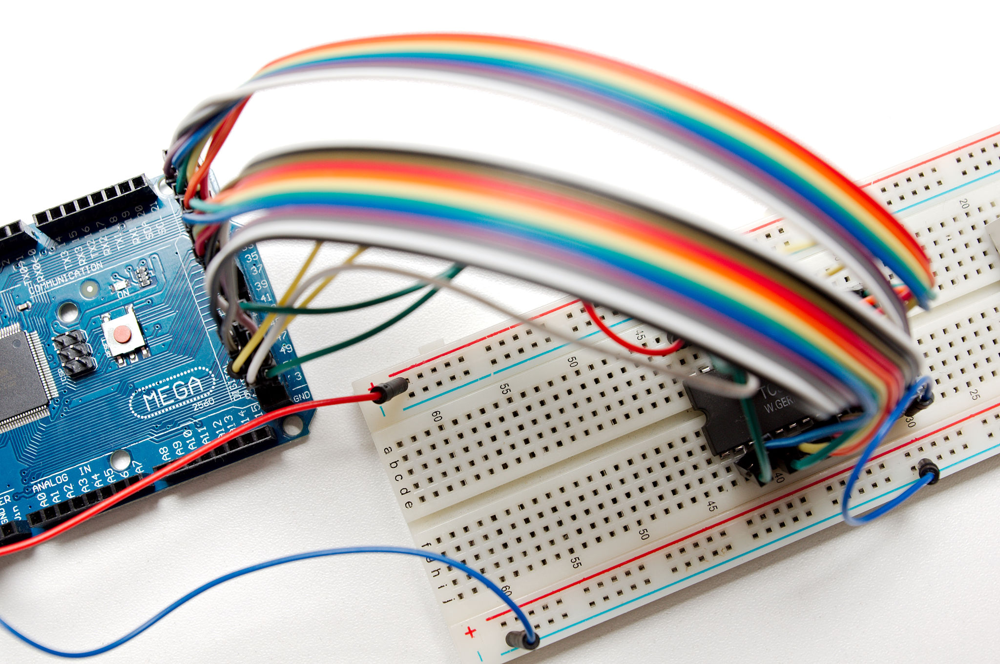

Toshiba TC5565A*L 8192 bytes CMOS RAM chip and Arduino MEGA 2560
================================================================

This Arduino MEGA program shows how to read and write from and to a Toshiba
TC5565A*L 8192 bytes CMOS RAM chip.

It uses the PORT* notation in order to make the program more concise and
faster (having more than 20 digitalWrite calls for writing one byte is not
very efficient).

Running the program
-------------------

The program first does bandwidth tests then does memory tests.

    Controlling Toshiba TC5565A*L 8192 bytes CMOS RAM.
    Each dot means a complete test set has been passed.
    Write speed: 3.21 µs / 311759.18 bytes/second
    Read speed: 3.90 µs / 256470.75 bytes/second

    ................................................................
    ................................................................
    ................................................................
    ................................................................
    ................................................................
    ................................................................
    ................................................................
    ................................................................
    ................................................................
    ...........................

Schematics and photos
---------------------

